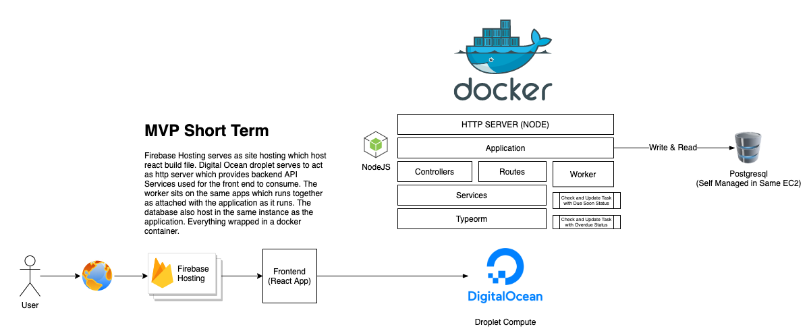

## Live System - Backend and Frontend Setup

This repository contains the backend and frontend setup for the Auction System.

## Live Preview
You can find live preview with the following link:
- Live System Demo : [https://checkbox-hendryzh.web.app/](https://checkbox-hendryzh.web.app/)
- Backend API Doc : [https://task-api.hendryzheng.com/api-docs/](https://task-api.hendryzheng.com/api-docs/)
- API Endpoint : [https://task-api.hendryzheng.com](https://task-api.hendryzheng.com)

## Infrastructure Setup
The infrastructure setup for this demo is using Firebase + Digital Ocean Environment with the following adoption usage:
- Digital Ocean Droplet : To provision the backend node server runs on Dockerized environment
- Firebase Hosting : To host React Distribution Build Files serves as static HTML

## Full Architecture
To understand better about the full architecture of this demo, please look at below diagram

## Backend

The backend consists of a Docker configuration file (`docker-compose.yml`) and a migration script that needs to be run during the first-time setup.

## OpenAPI Spec

You can also access the API documentation via Swagger UI here [Backend API Docs](http://task-api.hendryzheng.com/api-docs)

### Built With
- (Node.js)[https://nodejs.org/]
- (Express)[https://expressjs.com/]
- (TypeScript)[https://www.typescriptlang.org/]
- (TypeORM)[https://typeorm.io/]
- (PostgreSQL)[https://www.postgresql.org/]

### Guide
You can find full guide for the backend setup in the [Backend Readme](./backend/readme.md)

## Frontend

The frontend is built using React and TypeScript. The `package.json` file contains the dependencies and scripts required for the frontend setup.

## Built With

- [React](https://reactjs.org/) - Front-end framework
- [TypeScript](https://www.typescriptlang.org/) - Typed JavaScript

### Guide
You can find full guide for the frontend setup in the [Frontend Readme](./frontend/README.md)

## Authors

- [HendryZheng](https://github.com/xen-HendryZheng)